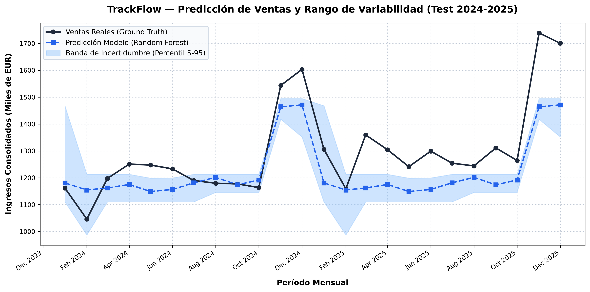

# AI Engineering Company Project — Student Template

[](https://4geeksacademy.com)
[](https://4geeksacademy.com/es/programas-de-carrera/ingenieria-ia)

_Base template for transversal projects in the AI Engineering Career Program — 4Geeks Academy._

> _Instrucciones disponibles en español en [README.es.md](./README.es.md)._

---

## TrackFlow — Sales Forecasting & Revenue Prediction

A production-grade machine learning forecasting pipeline designed to predict monthly consolidated revenues (`revenue_eur`) for TrackFlow's logistics operations across the US (Los Angeles) and Spain (Zaragoza).

### 1. Executive Summary & Model Justification (Finance & Leadership)

- **Algorithm Choice:** **Random Forest Regressor** (`n_estimators=100`, `random_state=42`).
- **Why Random Forest for Finance:**
  - **Auditability & Explainability:** Unlike black-box deep learning architectures, Random Forest is an ensemble of decision trees where feature contributions to revenue (e.g. Q4 holiday peak vs. February dip) can be clearly traced and audited by financial controllers.
  - **Empirical Uncertainty Bands:** Because the forest consists of 100 individual estimator trees, we compute the empirical 5th and 95th percentiles of tree forecasts. This gives Finance a natural, distribution-free risk interval ($p_{05}$ to $p_{95}$) for budget scenarios and sensitivity analysis.
  - **Robustness:** Resilient to seasonal spikes and post-holiday drops without overfitting.

### 2. Temporal Split & Data Leakage Prevention

- **Historical Range:** 10 years of consolidated monthly data (120 records from `2016-01` to `2025-12`).
- **Training Set:** First **8 years** (`2016-01` to `2023-12`, 96 months).
- **Test / Verification Set:** Last **2 years** (`2024-01` to `2025-12`, 24 months).
- **Leakage Safeguards:**
  - Strict chronological cutoff: $\max(\text{train\_date}) < \min(\text{test\_date})$.
  - Zero index/sample overlap between partitions.
  - Feature transformers (`StandardScaler`) fit **exclusively** on training data and only applied via `.transform()` to test data.

### 3. Test Evaluation Metrics (2024-2025 Test Set)

| Metric | Value | Finance Interpretation & Status |
|---|---|---|
| **MSE (Mean Squared Error)** | `13,322,085,784.57 €²` | Error cuadrático medio de la predicción en el período de 24 meses. |
| **RMSE (% of Mean Revenue)** | `115,421.34 €` (**8.88%**) | Desviación estándar del error; representa menos del 9% de la facturación media mensual. |
| **Normalized Gini** | **`0.6788`** (Raw: `0.0433`) | Alta capacidad discriminante para ordenar correctamente meses pico vs. meses valle. |
| **K2 Score (D'Agostino-Pearson)** | `0.5924` ($p = 0.7436$) | $p > 0.05$: Residuos normales sin sesgo sistemático en las estimaciones. |
| **PSI (Population Stability Index)** | `5.5268` | Deriva poblacional esperada por el crecimiento acumulado del 6% anual en 10 años. |
| **WAPE (Weighted Abs. % Error)** | **`7.09%`** | Margen de error porcentual ponderado sobre la facturación global de test. |
| **MAE (Mean Absolute Error)** | `92,055.18 €` | Error medio absoluto por mes evaluado. |

### 4. Metrics Plain-Language Guide for Finance Stakeholders

1. **MSE / RMSE (Error Cuadrático y Desviación Promedio):**
   - *¿Qué significa?* Mide la distancia promedio entre las ventas reales y las predichas. El RMSE (115.421 €) equivale a un 8.88% de las ventas mensuales promedio (~1.3M €), proporcionando un margen de error estrecho para planificación de flujo de caja.
2. **Normalized Gini (Capacidad de Discriminación y Ordenamiento):**
   - *¿Qué significa?* Indica si el modelo sabe priorizar correctamente qué meses tendrán mayor facturación (ej. Black Friday/Navidad) y cuáles menor (ej. Febrero). Un Gini normalizado de 0.68 confirma que el modelo no confunde una estacionalidad baja normal con una anomalía operativa.
3. **K2 Score de Residuos (Diagnóstico de Sesgo):**
   - *¿Qué significa?* Comprueba si los errores del modelo se distribuyen de forma simétrica e impredecible (ruido blanco). Un p-valor de 0.74 (> 0.05) certifica que el modelo no está sobreestimando ni subestimando sistemáticamente los ingresos.
4. **PSI (Índice de Estabilidad Poblacional):**
   - *¿Qué significa?* Evalúa si la distribución de ventas de los últimos 2 años es idéntica a la de los 8 años anteriores. El valor elevado refleja el crecimiento anual compuesto de la compañía (3-9% anual), confirmando la expansión del negocio.
5. **WAPE (Error Porcentual Absoluto Ponderado):**
   - *¿Qué significa?* El error total acumulado respecto a la facturación real total es de solo el 7.09%, cumpliendo holgadamente el criterio de precisión financiera para presupuesto anual.

### 5. Forecast Visualization

The forecast chart with the 5th-95th percentile variability band is generated at:
`reports/figures/sales_forecast_trackflow.png`



### 6. How to Run the Pipeline & Tests

```bash
# Run unit tests verifying 8/2 temporal split & anti-leakage
uv run pytest tests/pipelines/test_sales_split.py

# Execute the complete training, evaluation, and visualization pipeline
uv run python -m src.pipelines.train_forecast
```

---

## Purpose

This repository is the **starter template** for transversal projects. You will work on real company scenarios (Brasaland, TrackFlow, Nexova), building deliverables that map to course milestones (Web, Programming, Backend, Telemetry, RAG, Agents, Workflows, Real-time).

- Create a template from this repository.
- Replace the placeholder `CONTEXT.md` with your assigned company context.
- Use `skills/` and the directory-level `README.md` files as working guidance.

---

## Current status of the template

The repository currently provides a **base folder structure and documentation skeleton**. It does not include runnable apps or global scripts yet.

- `CONTEXT.md` is a placeholder and must be replaced with your assigned company context.
- There is no root `AGENTS.md` yet.
- Shared package metadata exists in `packages/shared/package.json` (`@repo/shared-types`), but no workspace runner is configured at root.

---

## Repository structure

```text
ai-engineering-company-project-template/
├── README.md
├── README.es.md
├── CONTEXT.md                # Placeholder to be replaced with assigned context
├── agents/                   # Agent patterns/templates and tools docs
├── uis/                     # Product apps (web, APIs, dashboards)
├── data/                     # raw, process, pipelines, eval
├── docs/                     # Project and architecture documentation
├── packages/
│   └── shared/               # Shared package (@repo/shared-types)
├── scripts/                  # Script conventions/documentation
├── shared/                   # Shared assets/conventions at repo level
├── skills/                   # Reusable agent skills
└── workflows/                # Automation/orchestration documentation
```

---

## How to start

1. **Use this repository as a template** and create your own project repo.
2. **Clone** your repository (or open it in Codespaces).
3. **Replace** `CONTEXT.md` with the full context for your assigned company.
4. **Review** each top-level folder `README.md` to understand intended responsibilities (`uis/`, `data/`, `skills/`, etc.).
5. **Start implementing** milestone deliverables in `uis/`, reusing `packages/shared/` and `data/` as needed.

---

## Milestones (reference)

| Milestone | Focus        | Typical deliverables                        |
| --------- | ------------ | ------------------------------------------- |
| 0         | Prework      | Environment setup, first prompts            |
| 1         | Web          | Corporate website, forms, SEO               |
| 2         | Programming  | Business logic, scoring, calculations       |
| 3         | AI-driven UI | AI-generated interfaces                     |
| 4         | Next.js      | Portals, loyalty app, operations UI         |
| 5         | Backend      | Central API (locations, menus, sales, etc.) |
| 6         | Telemetry    | Data pipeline, dashboards                   |
| 7         | RAG & Memory | Semantic knowledge base, search             |
| 8         | Agents       | Support, onboarding, training agents        |
| 9         | Workflows    | n8n automations                             |
| 10        | Real-time    | Live dashboards, alerts, streaming          |

---

## Links

- [4Geeks Academy — AI Engineering](https://4geeksacademy.com/es/programas-de-carrera/ingenieria-ia)
- [How to start a coding project](https://4geeks.com/lesson/how-to-start-a-project)

---

## Contributors

This template was built as part of the 4Geeks Academy AI Engineering Career Program by [@marcogonzalo](https://www.linkedin.com/in/marcogonzalo) and [@alezanchezr](https://x.com/alesanchezr) and many other contributors. Find out more about our [AI Engineering Course](https://4geeksacademy.com/en/career-programs/ai-engineering), and [other courses](https://4geeksacademy.com/en/program-comparison).

You can find other templates and resources like this at the [4Geeks Academy GitHub page](https://github.com/4geeksacademy).

_This template is maintained by 4Geeks Academy for the AI Engineering track. For exclusive use in the programme._
