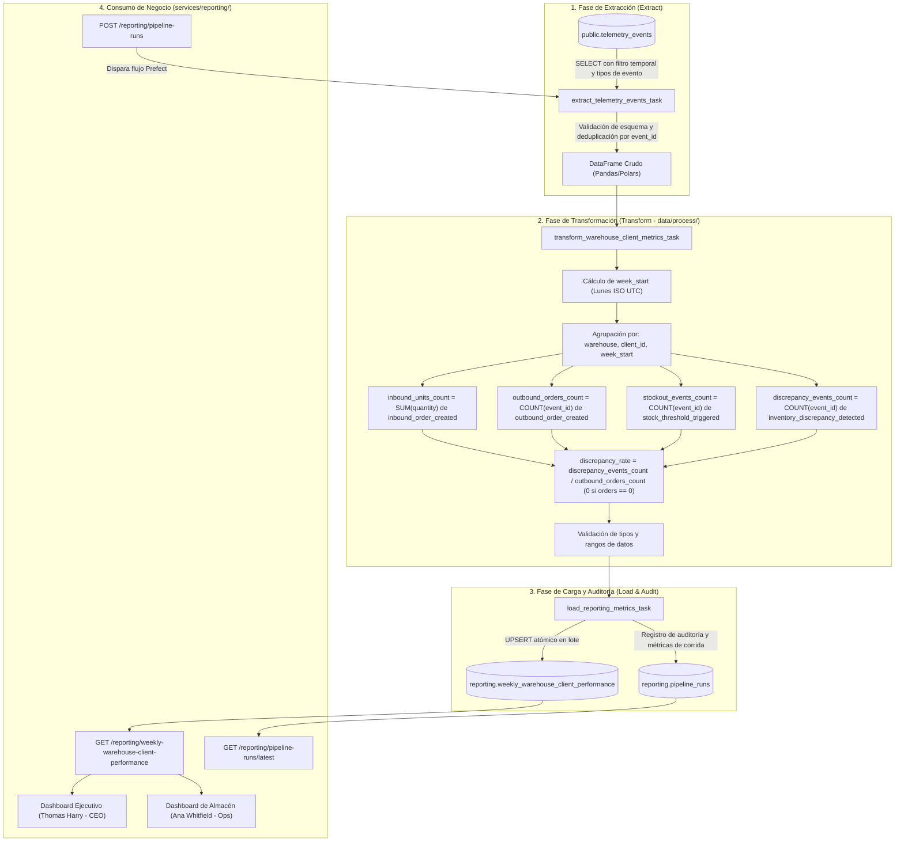

# Diseño Técnico y de Negocio: Pipeline de Desempeño por Almacén y Cliente (TrackFlow)

**Documento de Arquitectura y Especificación de Pipeline de Datos (Prefect)**  
**Ubicación:** `data/pipelines/PIPELINE_DESIGN.md`  
**Autor:** TrackFlow Tech Data & AI Engineering Team  
**Stakeholders Destino:** Thomas Harry (CEO) & Ana Whitfield (Head of Warehouse Operations)  
**Versión:** 1.0.0 (Hito Data Pipeline - Parte 1 de 3)

---

## 1. Estado Actual y Brecha de Negocio

### 1.1 Eventos de Telemetría Capturados en `telemetry_events`
Actualmente, la infraestructura de telemetría de TrackFlow almacena eventos operativos y técnicos en la tabla `telemetry_events` (SQLModel / PostgreSQL + SQLite) bajo el siguiente sobre estructurado:
- `event_id` (UUID v4, Primary Key)
- `timestamp` (ISO 8601 UTC)
- `session_id` (Identificador de sesión técnica o de usuario)
- `user_id` (UUID de usuario autenticado o `null`)
- `event_type` (Taxonomía `entity_action`)
- `service` (Servicio emisor, e.g., `backoffice`)
- `request_id` (Correlation ID frontend-backend)
- `tags` (Payload JSONB con propiedades filtradas mediante allowlist estricta)

Entre los eventos recolectados se encuentran:
1. `inbound_order_created`: Creación y recepción de pedidos de entrada (`warehouse`, `client_id`, `product_id`, `quantity`, `order_id`, `reference`, `user_uuid`).
2. `outbound_order_created`: Procesamiento y despacho de pedidos de salida (`warehouse`, `client_id`, `product_id`, `quantity`, `order_id`, `exit_type`, `tracking_number_present`, `user_uuid`).
3. `stock_threshold_triggered`: Alertas de nivel de stock bajo respecto al umbral de seguridad (`warehouse`, `client_id`, `product_id`, `minimum_threshold`, `deficit_units`).
4. `inventory_discrepancy_detected`: Discrepancias físicas vs. lógicas detectadas en auditorías (`warehouse`, `client_id`, `product_id`, `physical_count`, `system_count`, `discrepancy_units`, `audit_id`).
5. `auth_login_succeeded` / `auth_login_failed`: Registro de autenticación.
6. `api_request_latency_sampled` / `api_request_failed`: Observabilidad HTTP.
7. `session_access_denied`, `backoffice_navigation_clicked`, `inventory_order_rejected_*`, `inventory_form_*`.

### 1.2 Alcance del Reporte Técnico Actual de Ingeniería
El módulo analítico actual (`services/telemetry/analysis.py`) y su endpoint asociado `GET /telemetry/report` proporcionan exclusivamente una visión de **salud técnica de software y sistemas**:
- **Volumen de eventos diario:** Conteo bruto de eventos registrados por día.
- **Tasa de errores por tipo:** Porcentaje y desglose de fallos en llamadas a la API (`api_request_failed`).
- **Tasa de fallos de autenticación:** Porcentaje de intentos fallidos sobre el total de intentos de login (`auth_login_failed`).
- **Latencia por ruta:** Métricas de latencia media, p95 y p99 por endpoint consumido.

### 1.3 Brecha de Negocio e Impacto Ejecutivo
Aunque el reporte técnico es vital para el equipo de Andrés Kim (CTO) y DevOps, **no responde a ninguna de las preguntas operacionales ni ejecutivas críticas** que rigen el negocio logístico de TrackFlow:

| Pregunta de Negocio No Resuelta | Impacto Operativo y Ejecutivo en TrackFlow |
| :--- | :--- |
| **¿Cuánta carga entrante procesó cada almacén por cliente durante la semana?** | Ana Whitfield (Head of Warehouse Operations) no puede planificar turnos ni dimensionar capacidades en Los Ángeles y Zaragoza de forma proactiva. |
| **¿Cuál es el throughput real de despacho por cliente y sede?** | No se visualiza la capacidad efectiva de preparación y salida de pedidos para marcas B2B. |
| **¿Con qué frecuencia caen los SKUs de un cliente en quiebre de stock?** | Miguel Torres (Comercial) carece de visibilidad temprana para alertar al cliente antes de que sufra quiebres visibles y roturas de servicio. |
| **¿Qué clientes y almacenes presentan mayores discrepancias de inventario?** | Se desconoce qué líneas operativas requieren auditorías físicas urgentes para proteger los márgenes y la confianza del cliente. |
| **¿Cómo se consolidan estos números para el CEO?** | Thomas Harry (CEO) depende de que los directores dediquen entre 3 y 4 horas cada domingo por la noche consolidando hojas de cálculo a mano, recibiendo datos obsoletos y propensos a error humano. |

---

## 2. Propósito y Especificación del Pipeline

### 2.1 Propósito del Pipeline (Declaración Ejecutiva en 1 Frase)
> El pipeline automatiza la generación semanal del **Reporte Semanal de Desempeño por Almacén y Cliente** para Thomas Harry (CEO) y Ana Whitfield (Head of Warehouse Operations), consolidando de forma programada cada lunes en la madrugada las métricas operacionales de **Volumen de Entrada (`inbound_units_count`)**, **Throughput de Salida (`outbound_orders_count`)**, **Frecuencia de Quiebre de Stock (`stockout_events_count`)** y **Tasa de Discrepancia de Inventario (`discrepancy_rate`)** a partir de los eventos de telemetría de Los Ángeles y Zaragoza.

### 2.2 Extracción de Datos
- **Tabla Origen:** `public.telemetry_events` (acceso en modo **estrictamente de solo lectura**).
- **Frecuencia de Ejecución:** Semanal, programada cada lunes a las 05:00:00 UTC (para tener datos frescos antes del inicio de la jornada en Zaragoza y Los Ángeles). Adicionalmente soporta ejecución manual bajo demanda para reprocesamiento.
- **Filtro de Extracción:**
  - `event_type IN ('inbound_order_created', 'outbound_order_created', 'stock_threshold_triggered', 'inventory_discrepancy_detected')`
  - `timestamp >= :start_timestamp AND timestamp < :end_timestamp` (donde la ventana por defecto cubre desde el lunes anterior `00:00:00 UTC` hasta el domingo subsiguiente `23:59:59.999999 UTC`).
- **Esquema de Payload Extraído (desde columna `tags` JSONB):**
  - `warehouse` (string: `los_angeles` o `zaragoza`)
  - `client_id` (string: identificador de la marca cliente, e.g. `fashion-co`, `tech-gear`)
  - `quantity` (integer: unidades procesadas en órdenes)
  - `order_id` (string: identificador único de pedido)
  - `discrepancy_units` (integer/numeric: unidades de diferencia física vs sistema)
  - `audit_id` (string: identificador de la auditoría)

### 2.3 Manejo de Updates y Registros Mutables
- Los eventos en `telemetry_events` son de naturaleza inmutable (append-only con `event_id` UUID v4 y timestamp UTC).
- Para evitar duplicidades en la fase de extracción por reintentos de red del cliente emisor o lecturas concurrentes, la extracción aplica una deduplicación determinista sobre `event_id`:
  ```sql
  SELECT DISTINCT ON (event_id)
      event_id,
      timestamp,
      event_type,
      tags->>'warehouse' AS warehouse,
      tags->>'client_id' AS client_id,
      (tags->>'quantity')::integer AS quantity
  FROM telemetry_events
  WHERE timestamp >= :start_date AND timestamp < :end_date
    AND event_type IN ('inbound_order_created', 'outbound_order_created', 'stock_threshold_triggered', 'inventory_discrepancy_detected')
  ORDER BY event_id, timestamp ASC;
  ```
- Si un pedido sufre una actualización posterior o corrección, dicha corrección se emite como un nuevo evento de telemetría correlacionado con timestamp más reciente, el cual es procesado y sumado según las reglas de agregación de la ventana temporal correspondiente.

### 2.4 Destino y Endpoints
- **Esquema y Tabla Destino:** `reporting.weekly_warehouse_client_performance`
- **DDL de la Tabla:**
  ```sql
  CREATE SCHEMA IF NOT EXISTS reporting;

  CREATE TABLE reporting.weekly_warehouse_client_performance (
    id UUID PRIMARY KEY DEFAULT gen_random_uuid(),
    warehouse TEXT NOT NULL,
    client_id TEXT NOT NULL,
    week_start DATE NOT NULL,
    inbound_units_count INTEGER NOT NULL DEFAULT 0,
    outbound_orders_count INTEGER NOT NULL DEFAULT 0,
    stockout_events_count INTEGER NOT NULL DEFAULT 0,
    discrepancy_events_count INTEGER NOT NULL DEFAULT 0,
    discrepancy_rate NUMERIC NOT NULL DEFAULT 0,
    computed_at TIMESTAMPTZ NOT NULL DEFAULT NOW(),
    CONSTRAINT uq_weekly_warehouse_client UNIQUE (warehouse, client_id, week_start)
  );
  ```
- **Endpoints Expuestos en `services/reporting/`:**
  1. `GET /reporting/weekly-warehouse-client-performance?week_start=YYYY-MM-DD`: Consulta de métricas agregadas por almacén y cliente para la semana solicitada o la más reciente.
  2. `GET /reporting/pipeline-runs/latest`: Consulta de estado, duración y metadata de la última ejecución del pipeline.
  3. `POST /reporting/pipeline-runs`: Disparo manual asíncrono/síncrono de una corrida del pipeline para una semana específica o la semana en curso.

### 2.5 Diagrama de Flujo del Pipeline (Arquitectura de 3 Capas)



---

## 3. Resiliencia, Idempotencia y Auditoría

### 3.1 Estrategia de Idempotencia
La idempotencia absoluta del pipeline se garantiza mediante la restricción única `UNIQUE (warehouse, client_id, week_start)` en la base de datos de destino y una sentencia SQL `UPSERT` (`INSERT ... ON CONFLICT DO UPDATE`) en la tarea de carga:

```sql
INSERT INTO reporting.weekly_warehouse_client_performance (
    warehouse,
    client_id,
    week_start,
    inbound_units_count,
    outbound_orders_count,
    stockout_events_count,
    discrepancy_events_count,
    discrepancy_rate,
    computed_at
) VALUES (
    :warehouse,
    :client_id,
    :week_start,
    :inbound_units_count,
    :outbound_orders_count,
    :stockout_events_count,
    :discrepancy_events_count,
    :discrepancy_rate,
    NOW()
)
ON CONFLICT (warehouse, client_id, week_start)
DO UPDATE SET
    inbound_units_count = EXCLUDED.inbound_units_count,
    outbound_orders_count = EXCLUDED.outbound_orders_count,
    stockout_events_count = EXCLUDED.stockout_events_count,
    discrepancy_events_count = EXCLUDED.discrepancy_events_count,
    discrepancy_rate = EXCLUDED.discrepancy_rate,
    computed_at = EXCLUDED.computed_at;
```

**Beneficios:**
- Ejecutar el pipeline 1 vez o 100 veces consecutivas para una misma semana produce exactamente el mismo estado final en la base de datos sin duplicar filas.
- Las reejecuciones manuales o automáticas tras fallos actualizan los valores calculados de forma atómica.

### 3.2 Casos de Borde Documentados y Mitigación

| Caso de Borde | Escenario Técnico | Estrategia de Mitigación en el Pipeline |
| :--- | :--- | :--- |
| **Duplicados en origen** | Reintentos de red del frontend/backend generan múltiples eventos idénticos con mismo `event_id` o mismo payload dentro de la misma ventana. | La tarea de extracción aplica deduplicación explícita `df.drop_duplicates(subset=['event_id'])` previo al procesamiento. |
| **Reintentos tras fallo** | El worker de Prefect o la conexión a la base de datos se interrumpe durante la carga. | La política de retries en Prefect reintenta la tarea hasta 3 veces con backoff exponencial. El `UPSERT` asegura que una carga parcial previa sea sobreescrita de forma limpia. |
| **Eventos tardíos (Late-arriving data)** | Dispositivos de escaneo en almacén o clientes offline sincronizan eventos de semanas pasadas con retardo. | El pipeline soporta un parámetro `target_week_start` o un lookback configurable (e.g., reprocesar semana `W` y semana `W-1` en cada ejecución) para refrescar métricas históricas de forma transparente gracias al UPSERT. |
| **Corridas concurrentes** | Dos triggers (manual y programado) se ejecutan en simultáneo para la misma semana. | Prefect controla la concurrencia a nivel de Flow/Deployment mediante `concurrency_limit = 1` o bloqueos transaccionales a nivel de clave en base de datos. |
| **División por cero** | Un cliente no tiene pedidos de salida (`outbound_orders_count = 0`) pero tiene discrepancias registradas. | Regla de transformación vectorial: `discrepancy_rate = np.where(outbound_orders > 0, discrepancy_events / outbound_orders, 0.0)`. |
| **Semana sin actividad** | Un cliente activo no registra eventos durante una semana. | No se insertan registros artificiales con ceros innecesarios a menos que esté explícitamente parametrizada la matriz completa cliente-almacén. |

### 3.3 Log y Esquema de Auditoría de Ejecuciones (`reporting.pipeline_runs`)
Para auditoría, trazabilidad y observabilidad del pipeline, se define la tabla `reporting.pipeline_runs`:

```sql
CREATE TABLE reporting.pipeline_runs (
    run_id UUID PRIMARY KEY DEFAULT gen_random_uuid(),
    pipeline_name TEXT NOT NULL,
    execution_status TEXT NOT NULL,
    target_week_start DATE NOT NULL,
    records_extracted INTEGER NOT NULL DEFAULT 0,
    records_loaded INTEGER NOT NULL DEFAULT 0,
    started_at TIMESTAMPTZ NOT NULL,
    completed_at TIMESTAMPTZ,
    duration_seconds NUMERIC,
    error_details JSONB,
    triggered_by TEXT NOT NULL DEFAULT 'scheduler'
);
```

#### Especificación de Campos de Auditoría:

| Nombre de Campo | Tipo de Dato | Justificación Técnica y de Auditoría |
| :--- | :--- | :--- |
| `run_id` | `UUID` | Identificador único universal de cada ejecución para correlación de logs en Prefect y trazas de observabilidad. |
| `pipeline_name` | `TEXT` | Nombre del pipeline ejecutado (e.g. `weekly_warehouse_client_performance_pipeline`) permitiendo reutilizar la tabla para futuros pipelines. |
| `execution_status` | `TEXT` | Estado final de la corrida (`RUNNING`, `COMPLETED`, `FAILED`, `CANCELLED`) para monitoreo de SLAs. |
| `target_week_start` | `DATE` | Fecha de inicio de la semana ISO procesada, garantizando trazabilidad de qué periodo fue recalculado. |
| `records_extracted` | `INTEGER` | Cantidad total de eventos leídos desde `telemetry_events`, útil para detectar anomalías de volumen o caídas de ingesta. |
| `records_loaded` | `INTEGER` | Cantidad de combinaciones (warehouse, client_id) persistidas en la tabla destino. |
| `started_at` / `completed_at` | `TIMESTAMPTZ` | Timestamps exactos de inicio y fin para calcular `duration_seconds` y auditar tiempos de procesamiento. |
| `error_details` | `JSONB` | Traza estructurada de errores (stack trace, código de error, paso que falló) en caso de excepciones durante la ejecución. |
| `triggered_by` | `TEXT` | Origen de la ejecución (`scheduler`, `manual_api`, `backfill_job`, `user_uuid`) para gobernanza y control de cambios. |

---

## 4. Mapeo a Prefect

### 4.1 Arquitectura de Flujos y Tareas (Flows & Tasks)
El diseño implementa un **Flow principal** orquestador y **cuatro Tasks especializadas** desacopladas:

1. **Flow Principal: `weekly_warehouse_client_performance_flow`**
   - **Firma:** `weekly_warehouse_client_performance_flow(target_week_start: str | None = None, triggered_by: str = "scheduler") -> dict[str, Any]`
   - **Responsabilidad:** Orquestar el ciclo de vida de la ejecución, resolver el rango temporal, inicializar el registro de auditoría en `reporting.pipeline_runs`, invocar secuencialmente las tareas y actualizar el estado final (éxito o fallo).

2. **Task 1: `extract_telemetry_events_task`**
   - **Entrada:** `start_date: datetime`, `end_date: datetime`, `db_block`
   - **Proceso:** Conecta a la base de datos en modo lectura, ejecuta la consulta SQL optimizada con filtro por ventana e indexación sobre `telemetry_events`, y extrae el dataset crudo en un DataFrame.
   - **Retries:** 3 reintentos con retraso de 10 segundos ante fallos de conexión transitorios.

3. **Task 2: `transform_warehouse_client_metrics_task`**
   - **Entrada:** `raw_df: pd.DataFrame`, `week_start: date`
   - **Proceso:** Invoca la lógica pura de transformación en `data/process/weekly_performance.py`:
     - Normalización de dimensiones (`warehouse` y `client_id`).
     - Suma de unidades entrantes (`inbound_units_count`).
     - Conteo de órdenes despachadas (`outbound_orders_count`).
     - Conteo de alertas de quiebre de stock (`stockout_events_count`).
     - Conteo de discrepancias (`discrepancy_events_count`).
     - Cálculo seguro de `discrepancy_rate = discrepancy_events_count / outbound_orders_count`.
   - **Validación:** Validación estricta con Pydantic/pandera para descartar registros con dimensiones nulas o métricas negativas.

4. **Task 3: `load_reporting_metrics_task`**
   - **Entrada:** `aggregated_df: pd.DataFrame`, `db_block`
   - **Proceso:** Ejecuta la transacción de inserción masiva (`UPSERT`) en la tabla `reporting.weekly_warehouse_client_performance`.
   - **Retries:** 2 reintentos con backoff.

5. **Task 4: `audit_pipeline_run_task`**
   - **Entrada:** `run_id: str`, `status: str`, `metrics: dict`, `error: str | None`
   - **Proceso:** Actualiza de forma atómica el registro en `reporting.pipeline_runs`.

### 4.2 Manejo de Estados en Prefect (State Handling)
- **Pending / Scheduled:** Corrida agendada en Prefect Cloud / Prefect Server según cron `0 5 * * 1` (Lunes 05:00 UTC).
- **Running:** Flujo en ejecución activa, actualizando el registro de auditoría a estado `RUNNING`.
- **Completed:** Flujo terminado con éxito tras validar que todas las filas calculadas se persistieron correctamente. Se genera un artefacto Markdown en Prefect con el resumen de métricas.
- **Failed:** Captura de excepciones no controladas mediante bloques `try...except` y hooks `on_failure`. Se persiste el stacktrace en `error_details` y se emite notificación de alerta.
- **Retrying:** Estado transitorio en tareas individuales cuando ocurren errores recuperables de red o timeout de base de datos.

### 4.3 Configuración de Prefect Blocks
Para desacoplar credenciales y parámetros de infraestructura del código fuente:
- **`SqlAlchemyConnector / DatabaseBlock` (e.g. `trackflow-database-credentials`):**
  - Almacena la cadena de conexión segura (PostgreSQL / SQLite / Supabase), pool size, timeout y modo SSL.
  - Permite rotar credenciales de base de datos sin alterar el código del pipeline.
- **`SlackWebhookBlock / EmailBlock` (opcional para alertas operacionales):**
  - Notifica a Andrés Kim (CTO) y al canal `#ops-alerts` si el pipeline semanal falla o si se detecta una tasa de discrepancia anómala en un cliente crítico.

---

## 5. Arquitectura de Integración (Services)

### 5.1 Separación Estricta de Capas
El proyecto respeta la siguiente separación arquitectónica:
- `data/pipelines/`: Contiene los flujos orquestados en Prefect (`weekly_performance_pipeline.py`), definición de tareas y orquestación.
- `data/process/`: Contiene la lógica analítica pura y funciones vectorizadas (`weekly_performance.py`), 100% testeables sin dependencias de base de datos ni de framework de orquestación.
- `services/reporting/`: Expone la capa de servicio API REST (FastAPI) con sus rutas y controladores. **No contiene lógica de extracción ni transformación (ETL)**; simplemente consulta las tablas de reporting o invoca los flows/funciones expuestas por `data/pipelines/`.

### 5.2 Especificación de los 3 Endpoints en `services/reporting/`

#### 1. Consulta de Métricas de Desempeño
- **Ruta:** `GET /reporting/weekly-warehouse-client-performance`
- **Parámetros Query:**
  - `week_start` (opcional, `YYYY-MM-DD`): Fecha de inicio de la semana a consultar. Si se omite, consulta la semana más reciente disponible en la base de datos.
  - `warehouse` (opcional, `los_angeles` | `zaragoza`): Filtro opcional por sede.
  - `client_id` (opcional, `str`): Filtro opcional por marca cliente.
- **Respuesta (200 OK):**
  ```json
  {
    "week_start": "2026-08-17",
    "total_records": 2,
    "entries": [
      {
        "warehouse": "los_angeles",
        "client_id": "fashion-co",
        "inbound_units_count": 4200,
        "outbound_orders_count": 980,
        "stockout_events_count": 3,
        "discrepancy_events_count": 2,
        "discrepancy_rate": 0.002
      },
      {
        "warehouse": "zaragoza",
        "client_id": "tech-gear",
        "inbound_units_count": 1850,
        "outbound_orders_count": 410,
        "stockout_events_count": 1,
        "discrepancy_events_count": 0,
        "discrepancy_rate": 0.0
      }
    ]
  }
  ```
- **Lógica Invocada:** Consulta directa mediante SQLModel / SQLAlchemy sobre `reporting.weekly_warehouse_client_performance`.

#### 2. Consulta de Estado del Pipeline
- **Ruta:** `GET /reporting/pipeline-runs/latest`
- **Parámetros Query:**
  - `pipeline_name` (opcional, default: `weekly_warehouse_client_performance_pipeline`)
- **Respuesta (200 OK):**
  ```json
  {
    "run_id": "9b1deb4d-3b7d-4bad-9bdd-2b0d7b3dcb6d",
    "pipeline_name": "weekly_warehouse_client_performance_pipeline",
    "execution_status": "COMPLETED",
    "target_week_start": "2026-08-17",
    "records_extracted": 7450,
    "records_loaded": 12,
    "started_at": "2026-08-18T05:00:00Z",
    "completed_at": "2026-08-18T05:00:14Z",
    "duration_seconds": 14.2,
    "triggered_by": "scheduler",
    "error_details": null
  }
  ```
- **Lógica Invocada:** Lectura del último registro ordenado por `started_at DESC` en `reporting.pipeline_runs`.

#### 3. Disparo Manual del Pipeline
- **Ruta:** `POST /reporting/pipeline-runs`
- **Cuerpo de Solicitud (JSON):**
  ```json
  {
    "target_week_start": "2026-08-17",
    "force_recompute": true
  }
  ```
- **Respuesta (202 Accepted / 200 OK):**
  ```json
  {
    "message": "Pipeline run triggered successfully",
    "run_id": "a8f3b12c-4e56-7890-abcd-ef1234567890",
    "target_week_start": "2026-08-17",
    "status": "RUNNING"
  }
  ```
- **Lógica Invocada:** Invoca la función `run_weekly_performance_pipeline(target_week_start=...)` expuesta por `data.pipelines.weekly_performance_pipeline` (o dispara el deployment de Prefect mediante el cliente de Prefect si está configurado en modo distribuido).

---

## 6. Resumen de Cumplimiento de Restricciones

- **Inmutabilidad de Telemetría Técnica:** `services/telemetry/analysis.py` y `GET /telemetry/report` permanecen intactos y sin modificaciones.
- **Destino Limpio:** Todas las tablas generadas pertenecen al esquema `reporting` (`reporting.weekly_warehouse_client_performance` y `reporting.pipeline_runs`), manteniendo `telemetry_events` como origen de solo lectura.
- **Alineación con el Negocio:** KPIs, entidades (`los_angeles`, `zaragoza`), actores (Thomas Harry, Ana Whitfield, Miguel Torres) y tablas corresponden con precisión milimétrica al documento de dominio `CONTEXT-empresa.md`.
